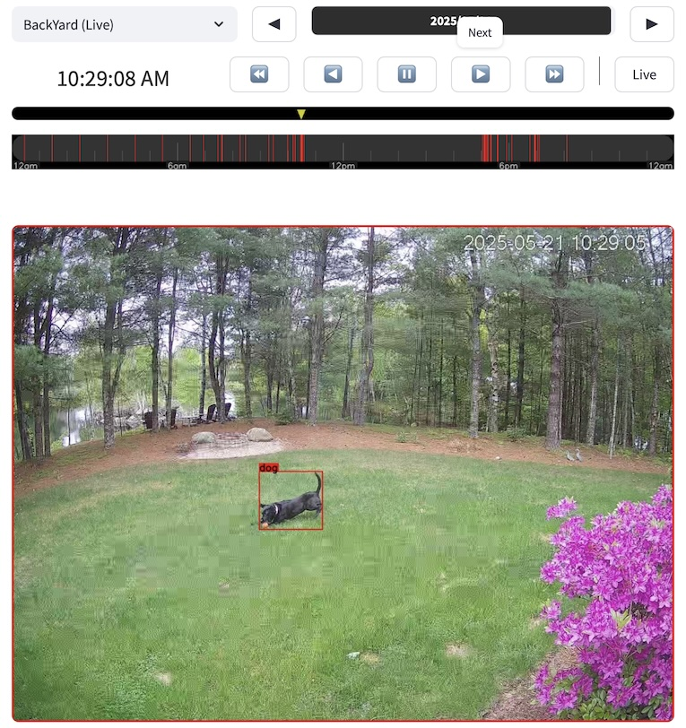

# JiffyCam

A modern Streamlit-based video capture utility for capturing and browsing video from cameras.

<p align="center">

</p>

## Overview

JiffyCam is a portable all-Python webapp that uses Streamlit for the UI to capture video from a camera, detect objects, save frames, and browse historical images. It provides an intuitive interface for real-time video capture and historical image browsing with time-based navigation.

## Features

- **Real-time capture**: Capture video from multiple camera devices
- **Object detection**: Built-in support for object detection with jiffydetect
- **Time-based browsing**: Navigate through historical images with an intuitive timeline interface
- **Interactive time controls**: Navigate via time slider, next/previous buttons, or direct time input
- **Live/Pause toggle**: Seamlessly switch between live view and browsing historical images
- **Status indicators**: Clear status messages for captures, saves, and browsing
- **Date picker**: Easily browse images from different dates
- **Configurable save interval**: Set automatic frame saving at custom intervals
- **Device management**: Easily switch between different camera devices

## Installation

1. Clone the repository:
   ```bash
   git clone https://github.com/your-username/jiffycam.git
   cd jiffycam
   ```

2. Install dependencies:
   ```bash
   pip install -r requirements.txt
   ```

3. Run the application:
   ```bash
   streamlit run jiffycam.py
   ```

   To run with a specific port:
   ```bash
   streamlit run jiffycam.py --server.port 8080
   ```
   
   To specify a custom data directory (overrides the default 'JiffyData'):
   ```bash
   streamlit run jiffycam.py CustomDataDir
   ```
   
   When using a custom data directory, JiffyCam will look for session-specific 
   configuration files in that directory (e.g., CustomDataDir/SessionName/jiffycam.yaml).
   
   Both jiffycam.py and jiffycapture.py support custom data directories:
   ```bash
   # For the Streamlit UI:
   streamlit run jiffycam.py CustomDataDir
   
   # For standalone capture:
   python jiffycapture.py DeviceAlias --data-dir CustomDataDir
   ```
Note: install and run in a Python virtual environment.

## Usage

### Camera Setup
1. Select camera device from dropdown in the sidebar.  See Configuration below.
2. Configure the save interval (in seconds) to control how often frames are saved
3. Click "Start Capture" to begin capturing video

### Navigation
- Use the date picker to select a date to browse
- Use the time slider to navigate to a specific time on that date
- Use the ◀ and ▶ buttons to move to previous or next frames
- Click "Live" to return to live view, or "⏸" to pause on the current frame

### Status Information
The application provides status information in the sidebar:
- Current FPS during live capture
- Timestamp information when viewing saved images
- Notifications when frames are saved
- Error messages if issues occur

## Configuration

JiffyCam stores its configuration in `jiffycam.yaml`. The main settings include:

- `cam_device`: Camera device identifier
- `cam_name`: Name used for captured images
- `save_interval`: Time between automatic object detection & saves (in seconds)
- `device_aliases`: Named aliases for camera devices
- `data_dir`: Directory where captures are stored

## Components

JiffyCam consists of several key components:

- **jiffycam.py**: Main application entry point, session state initialization.
- **jiffyui.py**: Builds the Streamlit UI components, handles callbacks, and manages the UI update loop.
- **jiffycapture.py**: Core video capture functionality, runs capture thread, manages frame queue.
- **jiffyconfig.py**: Handles loading, saving, and managing configuration from `jiffycam.yaml`.
- **jiffydetect.py**: Object detection functionality (optional).
- **jiffyput.py**: Frame processing and storage module (saves frames).
- **jiffyget.py**: Image retrieval module (loads saved frames).

## Recent Improvements

- **State of Flux**: early development with major unpredictable changes

## Data Storage

Captured frames are stored in [CloudTurbine](https://cloudturbine.com) compatible folders:
```
JiffyData/
└── [Session]/
    └── [CameraName]/
        └── [Timestamp]/
            └── [CameraName].jpg
```

## License

This project is licensed under the MIT License. See the [LICENSE](LICENSE) file for details.

## Contact

For any inquiries or issues, please contact:

- GitHub: [cycronix](https://github.com/cycronix)


## Acknowledgements

- Coded with AI help using [Cursor](https://cursor.com)
- Built with [Streamlit](https://streamlit.io/) webapp
- Uses [OpenCV](https://opencv.org/) for video capture
- Uses [Ultralytics](https://ultralytics.com) for object detection


