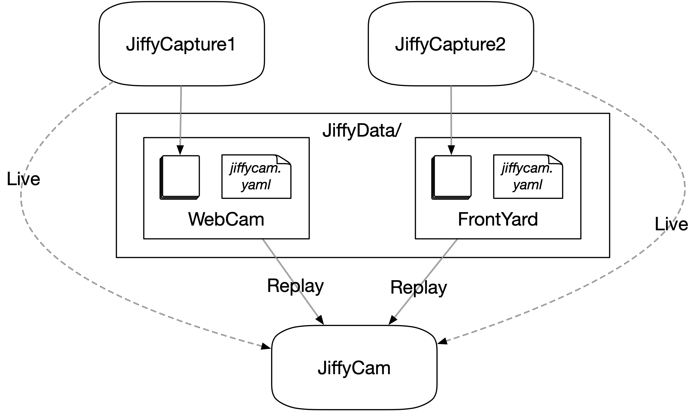

# JiffyCam

A modern Streamlit-based all-Python video capture utility for capturing and browsing video from cameras. It provides an intuitive interface for real-time video capture and historical image browsing with time-based navigation.

<p align="center">

</p>

## Architecture Overview

JiffyCam consists of two complementary but independent applications that work together to provide a complete video capture and browsing solution:

<p align="center">

</p>

### Core Components

**🎥 jiffycam.py - Web-based Viewer Application**
- Streamlit-based web interface for browsing and viewing captured images
- Provides intuitive time-based navigation with timelines and date pickers
- Displays live video feeds and historical image browsing
- Can operate independently to view existing captured data
- Connects to capture backend via HTTP API when available

**📷 jiffycapture.py - Video Capture Engine**
- Standalone video capture application that can run independently
- Captures video from camera devices and saves frames automatically
- Includes built-in HTTP server for serving live images and status
- Provides sophisticated object detection with YOLOv8 and custom filters
- Can run as a background service without any UI dependencies

### How They Work Together

The two components are designed to be **complementary but independent**:

1. **Independent Operation**: Each component can run standalone
   - `jiffycapture.py` can capture and save images without any viewer
   - `jiffycam.py` can browse existing captured data without active capture

2. **Seamless Integration**: When both are running, they work together seamlessly
   - The viewer automatically detects and connects to the capture engine
   - Live video feeds are streamed from capture to viewer via HTTP

3. **Flexible Deployment**: This architecture supports various deployment scenarios
   - Single machine: Both components running together
   - Distributed: Capture on edge devices, viewing from remote locations
   - Batch processing: Capture runs continuously, viewer used for analysis

## Installation

### Prerequisites

- Python 3.8 or higher
- pip (Python package installer)
- Virtual environment (recommended)

### Setup Steps

1. Clone the repository:
   ```bash
   git clone https://github.com/your-username/jiffycam.git
   cd jiffycam
   ```

2. Create and activate a virtual environment:
   ```bash
   python -m venv venv
   source venv/bin/activate  # On Windows: venv\Scripts\activate
   ```

3. Install dependencies:
   ```bash
   pip install -r requirements.txt
   ```

4. Run the application:
   ```bash
   streamlit run jiffycam.py
   ```

### Running Options

- Run on a specific port:
   ```bash
   streamlit run jiffycam.py --server.port 8080
   ```
   
- Use a custom data directory:
   ```bash
   streamlit run jiffycam.py CustomDataDir
   ```

- Run standalone capture:
   ```bash
   python jiffycapture.py CustomDataDir
   ```

## Usage

### Camera Setup
1. Configure the camera device in `jiffycam.yaml`
2. Configure the save interval (in seconds) to control how often frames are saved
3. Click "Start Capture" to begin capturing video

### Navigation
- Use the date picker to select a date to browse, or the "Live" button for current
- Click the timeline to navigate to a specific time on that date
- Use the ◀ and ▶ buttons to move to previous or next image
- Use the ◀◀ or ▶▶ buttons to automatically scroll through data
- Click "Live" to return to live view, or "⏸" to pause on the current frame

### Status Information
The application provides status information in the sidebar:
- Link to github source code
- View jiffycam.yaml configuration for this jiffycapture camera
- Error messages if issues occur

## Configuration

JiffyCam uses a YAML configuration file (`jiffycam.yaml`) for settings. Here's a sample configuration:

```yaml
cam_device: '0'  # Camera device identifier
cam_name: 'cam0'  # Name used for captured images
save_interval: 600  # Time between automatic saves (seconds)
detect_interval: 5  # Time between object detection runs (seconds)
dataserver_port: 8081  # Port for the data server
weights: 'models/yolov8l.pt'  # Path to YOLOv8 model weights
```

### Configuration Locations

The jiffycam.yaml file must be present in the JiffyData/<Camera-Session> folder.  Both jiffycam viewer and jiffycapture use this configuration info in common.  Jiffycapture is the primary user in that it sets the image acquisition parameters.  The jiffycam viewer uses this to discover the 'dataserver-port' to query for capture status and live images if available.

- Session-specific file location: `[data_dir]/[SessionName]/jiffycam.yaml`

## Source Code Components

JiffyCam consists of several key components:

- **jiffycam.py**: Main application entry point, session state initialization
- **jiffyui.py**: Builds the Streamlit UI components, handles callbacks, and manages the UI update loop
- **jiffycapture.py**: Core video capture functionality, runs capture thread, manages frame queue
- **jiffyconfig.py**: Handles loading, saving, and managing configuration from `jiffycam.yaml`
- **jiffydetect.py**: Object detection functionality using YOLOv8
- **jiffyput.py**: Frame processing and storage module (saves frames)
- **jiffyget.py**: Image retrieval module (loads saved frames)

## Data Storage

Captured frames are stored in [CloudTurbine](https://cloudturbine.com) compatible time-stamped folders:
```
JiffyData/
└── [Session]/
    └── [CameraName]/
        └── [Timestamp]/
            └── [CameraName].jpg
```

## Development

### Contributing

1. Fork the repository
2. Create a feature branch
3. Commit your changes
4. Push to the branch
5. Create a Pull Request

### Building from Source

```bash
# Clone the repository
git clone https://github.com/your-username/jiffycam.git

# Install development dependencies
pip install -r requirements.txt

```

## License

This project is licensed under the MIT License. See the [LICENSE](LICENSE) file for details.

## Contact

For any inquiries or issues, please contact:

- GitHub: [cycronix](https://github.com/cycronix)

## Acknowledgements

- Coded with AI help using [Cursor](https://cursor.com)
- Built with [Streamlit](https://streamlit.io/) webapp
- Uses [OpenCV](https://opencv.org/) for video capture
- Uses [Ultralytics](https://ultralytics.com) for object detection


